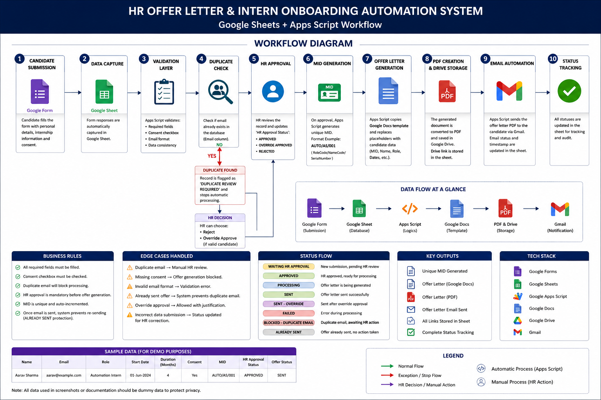
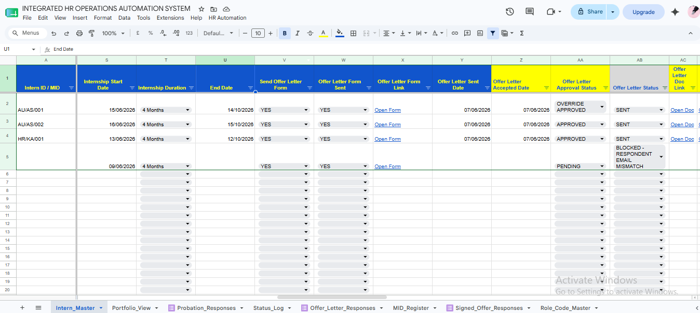
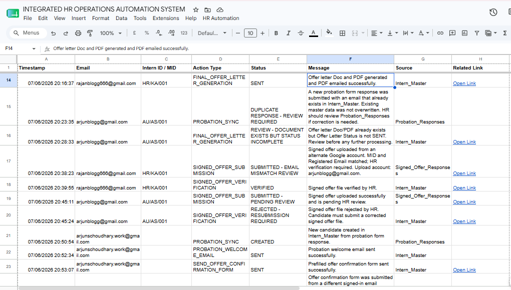
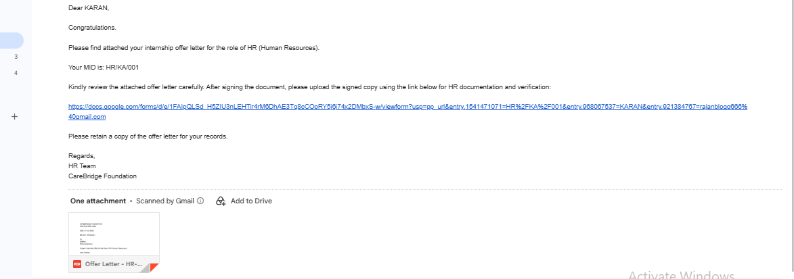
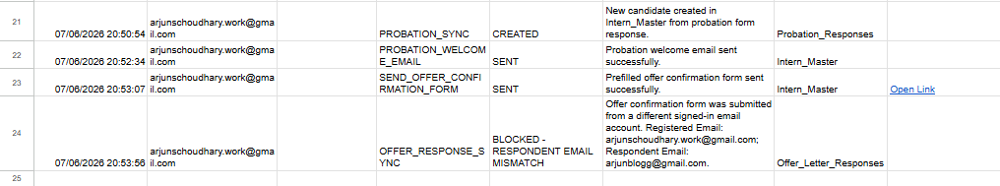
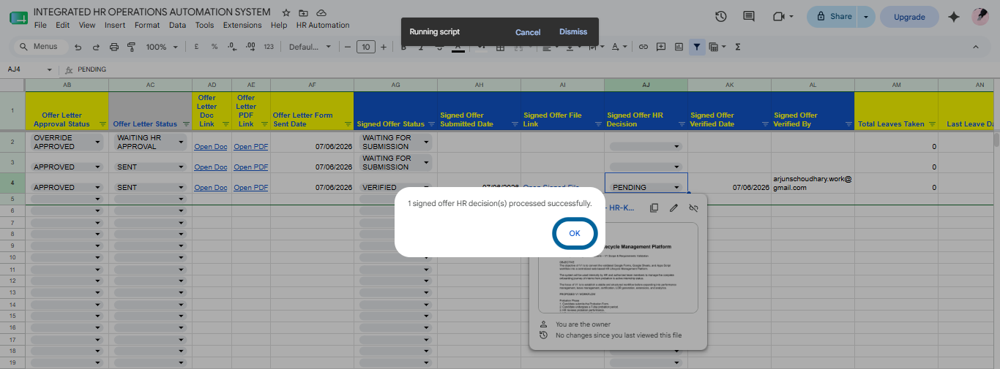
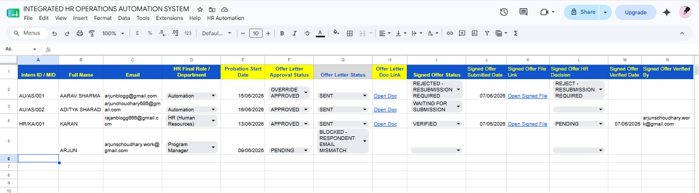
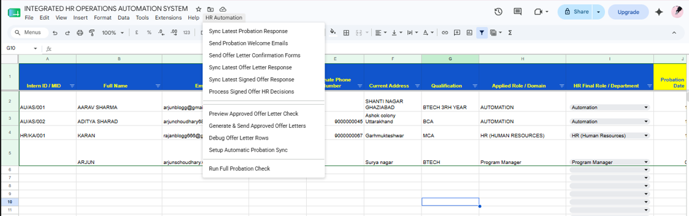

# HR Offer Letter & Intern Onboarding Automation System

Google Sheets and Apps Script based HR offer letter and intern onboarding automation system.

## Overview

This project automates the intern onboarding workflow using Google Forms, Google Sheets, Google Apps Script, Google Docs, Google Drive, and Gmail.

It handles candidate data capture, validation, HR approval, MID generation, offer letter creation, PDF generation, email delivery, status tracking, and signed offer tracking.

## Screenshots

### 1. Workflow Diagram

### 2. Intern Master Offer Tracking

### 3. Status Log Automation History

### 4. Offer Email with PDF and Pre-filled Link

### 5. Offer Response Email Mismatch

### 6. Signed Offer Tracking

### 7. Portfolio Summary View

### 8. HR Automation Controls

